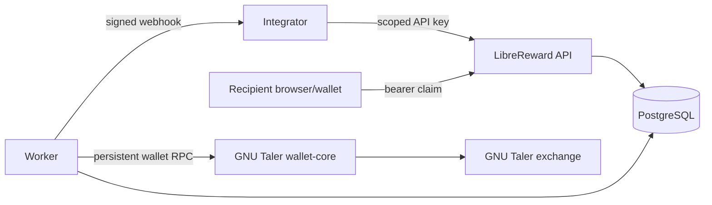

# LibreReward Bridge

[](https://github.com/robyroro/libreward-bridge/actions/workflows/ci.yml)

A privacy-preserving open-source bridge for distributing exact-value rewards through GNU Taler.

> **Maturity: v0.1.0-alpha.1 research prototype.** Core flows and valueless GNU Taler sandbox interoperability have been demonstrated. Independent security, privacy, legal, and treasury reviews have not been completed. Do not use this release with real money.

LibreReward gives an integrator a small authenticated API for creating an exact-value reward, a single-use bearer claim link, asynchronous funding from an operator-controlled wallet, lifecycle events, and signed final-state webhooks. A recipient needs no LibreReward account and supplies no identity data. The service is generic infrastructure, not an integration for any particular commercial platform.

## Scope and privacy model

GNU Taler provides wallet-to-wallet peer-push claims without requiring LibreReward to create or custody a recipient wallet. LibreReward does not operate an exchange, bank, or merchant backend. It does not independently resolve KYC, AML, sanctions, safeguarding, tax, or accounting duties; every operator needs jurisdiction-specific review.

Claim links and prepared Taler URIs are bearer capabilities. The service hashes API and claim credentials, encrypts recoverable provider URIs and webhook secrets, uses no claim-page cookies or analytics, and requires no recipient identity. IP addresses can still appear in infrastructure logs, and tenant metadata can contain personal data if an integrator misuses it. See [Privacy](docs/PRIVACY.md) and [Data lifecycle](docs/DATA_LIFECYCLE.md).



Full diagrams and trust boundaries are in [Architecture](docs/ARCHITECTURE.md).

## Quick start with the mock provider

The mock provider is development-only and transfers no value.

```sh
cp .env.example .env
# Replace all example secrets, then:
docker compose up --build
docker compose run --rm api node dist/src/cli.js tenant:create --name demo
```

Without Docker, provide PostgreSQL and the variables in `.env.example`, then run:

```sh
npm ci
npm run migrate
npm run cli -- tenant:create --name demo
npm run dev
# In another terminal:
npm run build && npm run worker
```

Use the one-time key returned by `tenant:create`:

```sh
curl -sS http://localhost:8080/v1/rewards \
  -H "Authorization: Bearer ${LIBREREWARD_DEMO_API_KEY}" \
  -H "Idempotency-Key: example-event-0001" \
  -H "Content-Type: application/json" \
  --data '{"amount":"KUDOS:5.25","description":"Test participation reward","external_reference":"opaque-0001"}'
```

Open the returned `claim_url`, start preparation, and poll its status. The normative contract is [openapi.yaml](openapi.yaml); see [API usage](docs/API.md), the [TypeScript SDK](sdk/typescript/client.ts), and the [generic reference integrator](examples/reference-integrator/README.md). GNU Taler testing is opt-in and valueless only; follow [Taler setup](docs/TALER_SETUP.md).

## Security properties and limitations

- Per-tenant idempotency, row locking, a unique provider operation, and serialized wallet calls reduce duplicate effects.
- An ambiguous wallet initiation is never automatically repeated. Known transaction IDs are retained for reconciliation.
- Webhooks use HTTPS in production, pinned validated DNS addresses, no redirects, bounded responses, HMAC signatures, event IDs, and bounded retry.
- Claim pages set no-store/no-referrer policies, use a restrictive CSP, and contain no remote assets, cookies, analytics, or identity inputs.
- Deployment defaults do not trust forwarded IP headers. A proxy hop count or IP/CIDR allowlist must be explicit.

This is not a formal security certification. Current blockers include upstream confirmation of the long-running wallet RPC boundary, independent review, key-ring support for online encryption-key rotation, and legal/treasury decisions. See [Known limitations](docs/KNOWN_LIMITATIONS.md) and [external review status](docs/SECURITY_PRIVACY_LEGAL_REVIEW.md).

## Development and release

```sh
npm ci
npm run validate
TEST_DATABASE_URL=postgres://... npm run test:integration:required
npm run test:coverage
npm audit --omit=dev
npm run license:check
npm run sbom
```

Integration tests intentionally fail when `TEST_DATABASE_URL` is absent; a skipped suite is not reported as integration coverage. Release and upgrade procedures are in [Release process](docs/RELEASE_PROCESS.md) and [Upgrade policy](docs/UPGRADE_POLICY.md). Planned work is in [ROADMAP.md](ROADMAP.md).

## Development transparency

Substantial AI assistance, including Codex and Claude, was used for implementation, documentation, testing assistance, and review. Maintainers remain responsible for every change. See [AI_USAGE.md](AI_USAGE.md); automated review is not independent security or legal review.

## License and contributing

LibreReward Bridge (`libreward-bridge`; package scope retained as `@libreward/bridge` to avoid needless consumer breakage) is licensed under AGPL-3.0-or-later. See [LICENSE](LICENSE), [third-party notices](THIRD_PARTY_NOTICES.md), [CONTRIBUTING.md](CONTRIBUTING.md), and [SECURITY.md](SECURITY.md).
