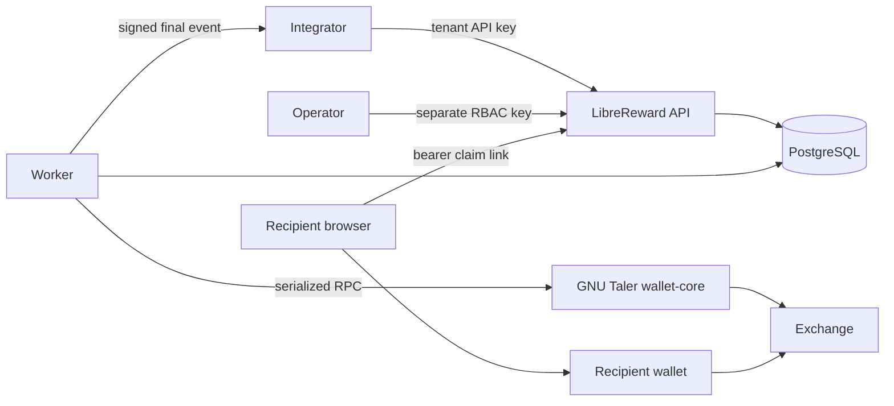
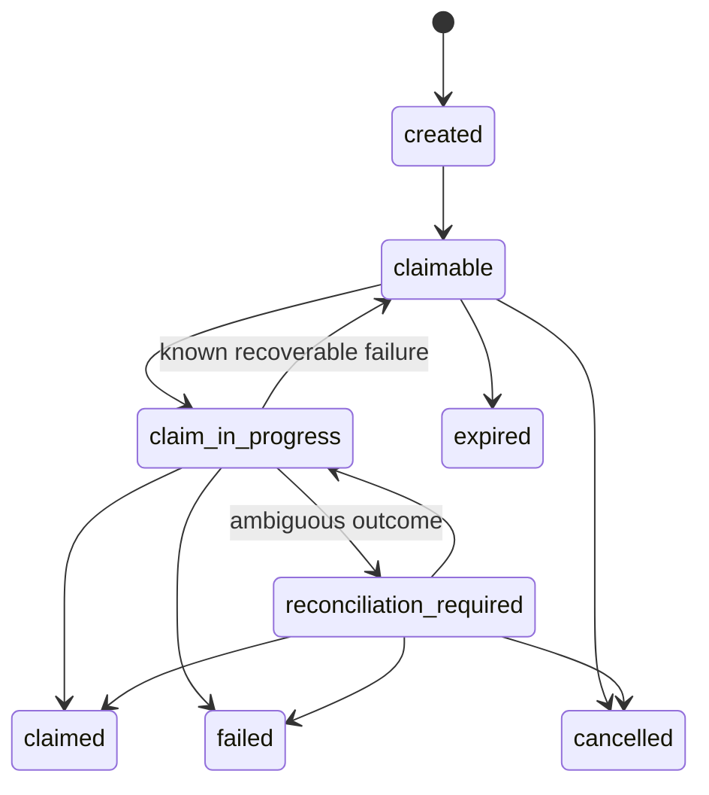
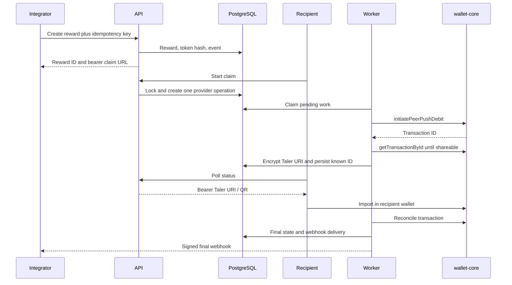
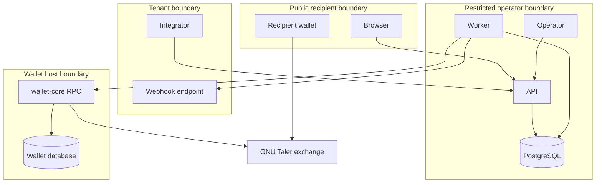
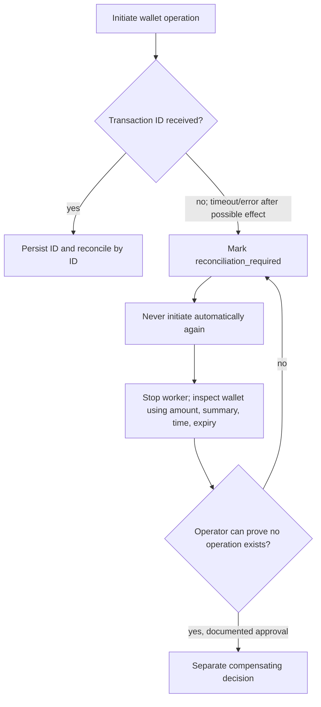

# Architecture

The API validates callers and public claims; PostgreSQL is the coordination and state boundary; the worker alone performs provider, liquidity, retention, and webhook effects. wallet-core is a separate high-trust process reached through a persistent local RPC connection. Recipient wallets, webhook receivers, and exchanges are external.

## System context

## Reward lifecycle

## Claim sequence

## Trust boundaries

## Unknown outcome

Creation uses a tenant-scoped idempotency key and canonical request fingerprint. Claim start locks the reward and token, consumes the capability, and creates one uniquely constrained provider operation. Workers use `FOR UPDATE SKIP LOCKED`; all wallet-affecting calls share a PostgreSQL advisory lock. This is effectively-once coordination, not a proof of mathematical exactly-once behavior across wallet-core.

Money is stored as whole `bigint` plus an eight-digit fraction. API and claim credentials are hashed. Provider URIs and webhook secrets use versioned AES-256-GCM envelopes. See [Threat model](THREAT_MODEL.md), [Data lifecycle](DATA_LIFECYCLE.md), and [Taler compatibility](TALER_COMPATIBILITY.md).
