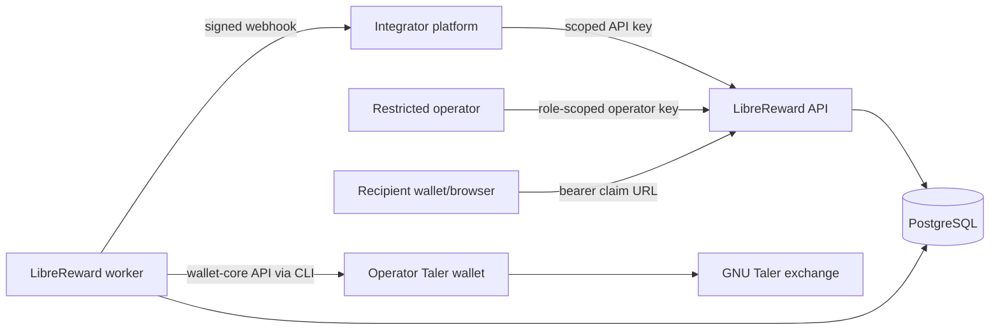
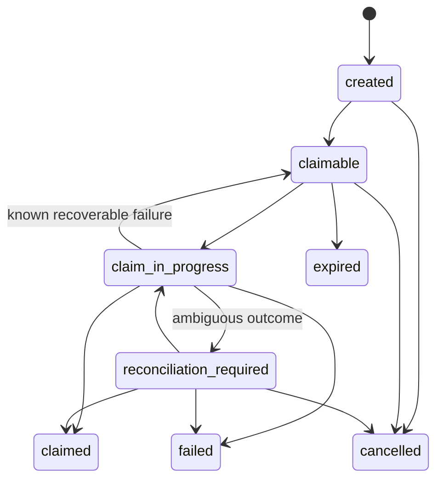
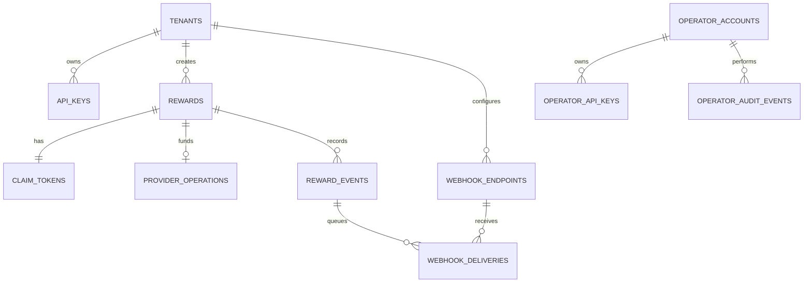

# Architecture

## Components and boundary

`api` separately authenticates tenants and role-scoped operators, validates JSON, creates rewards, serves claims, manages webhooks, queues wallet checks, and records operator audits. `worker` performs provider operations under a PostgreSQL advisory lock, reconciles wallet transactions, checks liquidity, expires claims, applies retention, and delivers webhooks. Both share PostgreSQL. `taler-wallet-cli` and its wallet database are an external high-trust dependency. Recipient wallets and exchanges are outside the deployment.

## Reward lifecycle

All transitions are centrally validated, performed under a row lock/optimistic version check, and append an event. Final events enqueue webhook deliveries in the same transaction.

## Data model

Money uses a signed-safe PostgreSQL `bigint` whole value and an integer fraction in units of 1e-8. The API canonical form is `CURRENCY:value.fraction`. Claim tokens and API keys are not stored plaintext. Provider claim URIs and webhook secrets use AES-256-GCM envelopes under a deployment key.

## Idempotency and concurrency

Reward creation has a unique `(tenant_id,idempotency_key)` constraint and canonical request fingerprint. Identical replays reconstruct the same pseudorandom claim token from stored random material plus a server PRF key; different payloads return `idempotency_conflict`. Claims lock the reward/token and create one unique `(reward_id,operation_type)` row. Workers claim work with `FOR UPDATE SKIP LOCKED`.

This is effectively-once, not mathematical exactly-once across wallet-core. Known external IDs are reconciled; an unknown timeout is quarantined for manual investigation.

## Deployment topology

Run at least one API and one worker against PostgreSQL. Multiple API instances and workers are supported; every Bridge wallet call uses a shared PostgreSQL advisory lock, and API-triggered checks are queued for workers. Direct wallet CLI maintenance is outside that lock, so stop workers first. An external hardened wallet service remains preferable if GNU Taler provides a supported operator boundary.
